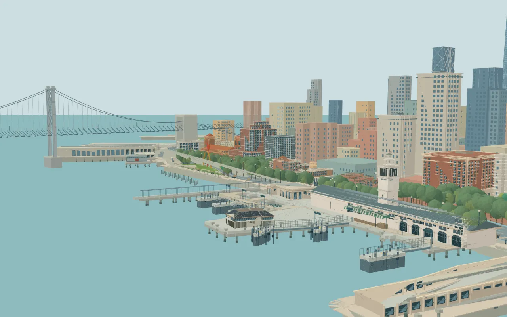

# San Francisco Waterfront

I wanted a fun, little, interactive cityscape of the Embarcadero as the header image for my portfolio. Here is the result, built with Typescript and Javascript primary.



Detailed representations of the the Ferry Building, Bay Bridge, surrounding architecture, people, parks, streetcars, ferries and a departing fireboat with a rotating water salute. Time of day, building lights and the clock follow the real time in San Francisco.

## Run locally

Use Node.js 22.18 or newer.

```sh
npm ci
npm run dev
```

Build static files with `npm run build`; review that build with `npm run preview`. `dist/` can be served by a static host. No backend, database, API key or ChatGPT account is needed.

## Explore

- Drag to orbit; select a landmark to move closer.
- Use the zoom, reset and pause controls at the bottom right.
- Focus the city and use the arrow keys to orbit, `+`/`−` to zoom, Escape to reset, and Enter to hear from a passerby.
- On touch screens, use two fingers to zoom. Motion pauses when the tab is hidden and respects reduced-motion preferences.

The fireboat leaves Station 35, performs its five-stream display, and returns on a two-minute animation cycle. Pausing the scene also pauses the boat and water.

## Development and updates

The city is maintained with Tom's portfolio project. A local post-commit hook exports the committed city dependency graph, its map, poster, styles and tests into this repository. It runs type checking, the geometry/animation tests and a production build before pushing to `main`. Portfolio copy, résumé content, contact information and hosting configuration are excluded.

`CITY-SOURCE.json` records the source revision and file hashes. The mirror never copies uncommitted portfolio edits. A failed check or push leaves a visible error and can be retried with `npm run city:sync` from the source project. Synchronization runs when the source project is committed on Tom's Mac; it is not a background cloud watcher.

The repository can be cloned and developed independently. Changes to the managed mirror should be made in the source project before synchronization; the sync process stops if someone has independently changed a managed file here.

## Checks

```sh
npm run check
npm run build
```

Tests cover finite batched geometry, daylight and DST, opening composition, street routes, ferry and fireboat clearance, water contact, shared character animation and atmospheric haze. Physical-device thermal behavior and frame-rate benchmarks have not been established.

## Attribution and rights

Map data © [OpenStreetMap contributors](https://www.openstreetmap.org/copyright), available under [ODbL 1.0](https://opendatacommons.org/licenses/odbl/1-0/). The derived waterfront dataset and source metadata are in `public/data/sf-waterfront.json`; keep the on-screen map attribution and dataset attribution when reusing it.

The poster is rendered from this project's own geometry. Buildings and vessels are stylized approximations, not surveyed reconstructions. The fireboat is inspired by the SFFD's St. Francis. No AI-generated bitmap artwork is used.

The bundled Helvetiker font includes its MAGENTA/MgOpen license in the JSON metadata and in `THIRD-PARTY-NOTICES.md`. Other dependencies retain their respective licenses.

Original project code and artwork © 2026 Tom Bunting. This public repository does not add a separate open-source license for that original work.
